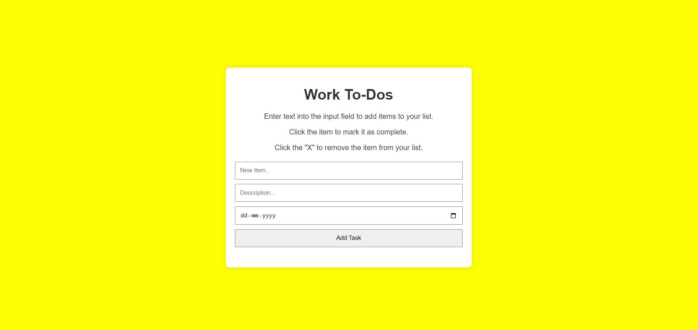

# Javascript-Assignment
Aim:To Create a fully functional To-Do-List application using ES6 JavaScript.
# output:

# Result:
Thus,fully functional To-Do-List application using ES6 JavaScript was executed successfuly.